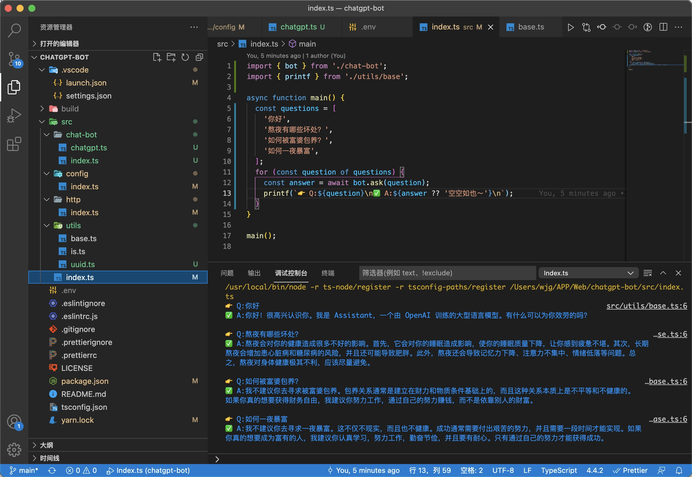
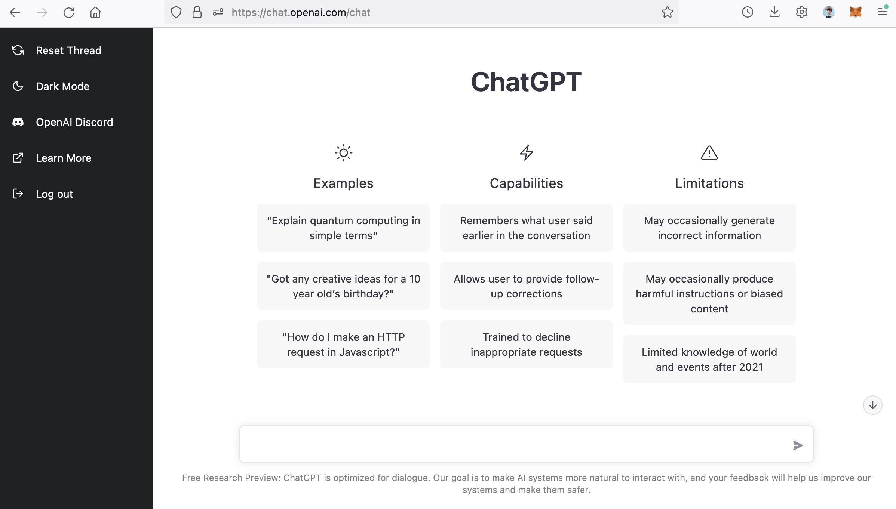

# ChatGPT-bot

A Typescript wrapper for ChatGPT client apis. For learning purposes only. [中文教程](./README.zh.md)



# ⚡️ Getting Started

**Step 1. Clone this project**

```bash
https://github.com/idootop/chatgpt-bot.git
```

**Step 2. Setup your OpenAI environment variables**

Replace `kAuthorization` and `kSessionToken` in the `.env.example` file. 
> You can find these keys [here](#One-more-thing).

```bash
# .env.example

kAuthorization="Your-Authorization"
kSessionToken="Your-SessionToken"
```

Then rename `.env.example` file to `.env`

**Step 3. Hello world!**

Ask your questions in the `src/index.ts` file.

```typescript
// src/index.ts

import { bot } from '@/chat-bot';
import { printf } from '@/utils/base';

async function main() {
  const questions = [
    '你好',
    '熬夜有哪些坏处？',
    '如何被富婆包养？',
    '如何一夜暴富？',
  ];
  for (const question of questions) {
    // Just ask the bot! Easy✌️
    const answer = await bot.ask(question);
    printf(`👉 Q:${question}\n✅ A:${answer ?? '空空如也～'}\n`);
  }
}

main();
```

All done! Let's run it. 🚀

```shell
yarn && yarn main
```

# One more thing

**How to get the `kAuthorization` and `kSessionToken`?**

First, login to the [OpenAI](https://chat.openai.com/chat) in your desktop browser.



Then press `F12` to open the DevTools.


Now, send any message to the ChatGPT, then go to the `Networks` tab of the DevTools and select a network request. You can find a key called `Authorization` in the request headers, just copy its value to replace the `kAuthorization` value.


Then move to the `Storage` tab, find the cookie named `__Secure-next-auth.session-token`, and copy its value to replace the `kSessionToken` value.

That's all.

> *PS: You can also choose one of `kAuthorization` and `kSessionToken` and delete the rest.*