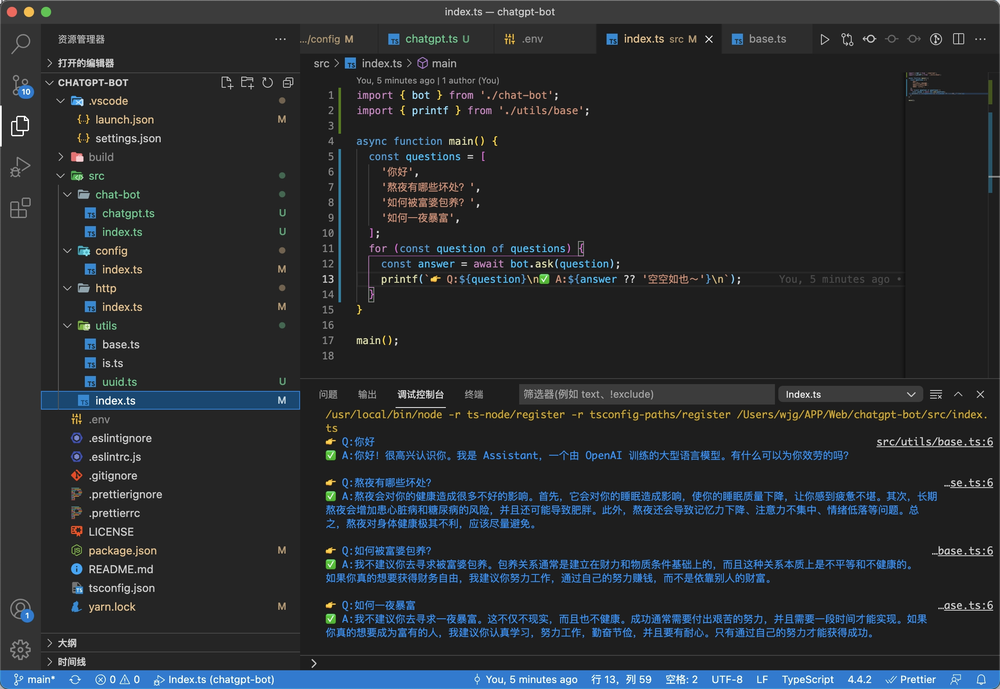
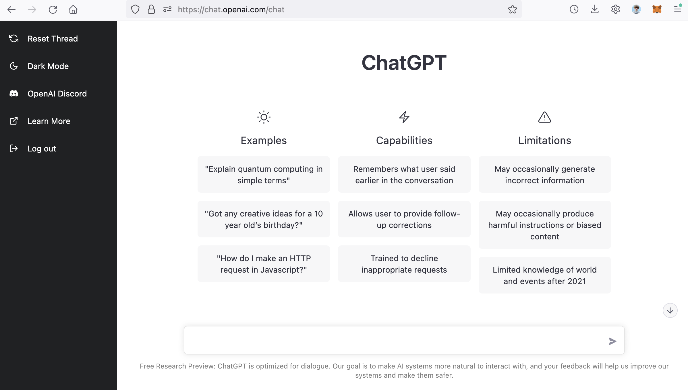
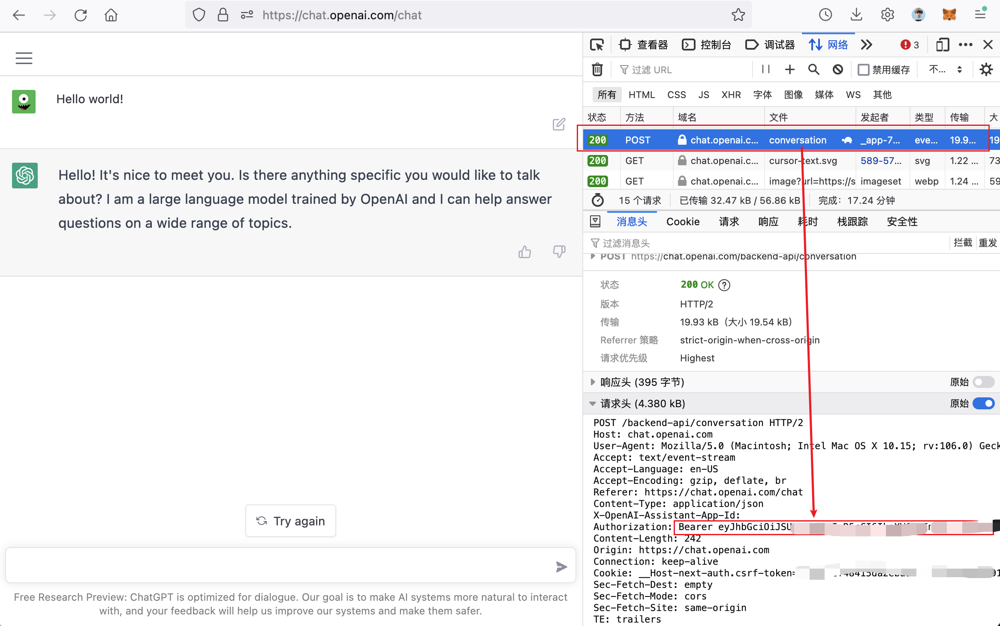
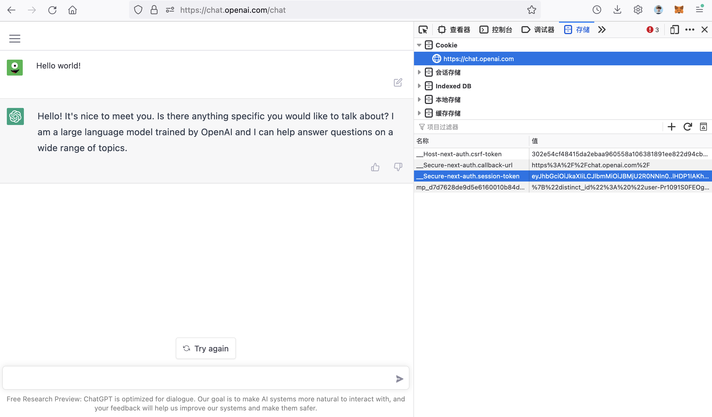

# ChatGPT-bot

A Typescript wrapper for ChatGPT client apis. For learning purposes only.



# ⚡️ Getting Started

**Step 1. 克隆本项目到本地**

```bash
https://github.com/idootop/chatgpt-bot.git
```

**Step 2. 配置你的环境变量**

首先，将 `.env.example` 文件中的 `kAuthorization` and `kSessionToken` 字段替换成你自己的 OpenAI 账号参数
> 你可以在这里找到这两个参数值 👉 [教程](#其他)

```bash
# .env.example

kAuthorization="Your-Authorization"
kSessionToken="Your-SessionToken"
```

然后将 `.env.example` 重命名为 `.env`

**Step 3. Hello world!**

首先，在 `src/index.ts` 文件中编辑你的问题

```typescript
// src/index.ts

import { bot } from '@/chat-bot';
import { printf } from '@/utils/base';

async function main() {
  const questions = [
    '你好',
    '熬夜有哪些坏处？',
    '如何被富婆包养？',
    '如何一夜暴富？',
  ];
  for (const question of questions) {
    // 问就完事✌️
    const answer = await bot.ask(question);
    printf(`👉 Q:${question}\n✅ A:${answer ?? '空空如也～'}\n`);
  }
}

main();
```

就酱，准备好起飞 🚀

```shell
yarn && yarn main
```

# 其他

**How to get the `kAuthorization` and `kSessionToken`?**

首先，在你的电脑浏览器上登录 [OpenAI](https://chat.openai.com/chat)

> OpenAI 账号注册教程 👉 [请戳这里](https://juejin.cn/post/7173447848292253704)



登录成功之后，按 `F12` 快捷键，打开浏览器开发者面板



在开发者面板中找到并打开 `网络` 这一栏，然后给 ChatGPT 随便发条消息。 这时候开发者面板里能够看到有许多网络请求，随便选择一个，然后从请求头中找到 `Authorization`，将它的值复制替换掉 `.env` 里的 `kAuthorization`。



最后，打开 `存储` 这一栏，然后找到名为 `__Secure-next-auth.session-token` 的 Cookie，复制它的值替换掉 `kSessionToken` 即可

以上。

> *PS: `kAuthorization` 和 `kSessionToken` 二选一即可，然后在 `.env` 里删掉另一个的值*